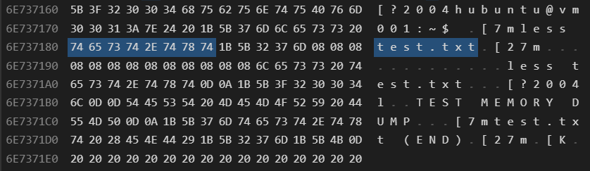

# 3. Атака №1 - доступ к оперативной памяти работающей VM

---

## Содержание

3. [Атака №1 – доступ к оперативной памяти работающей VM](#атака-1---доступ-к-оперативной-памяти-работающей-vm)
   - [Моделирование работы пользователя внутри виртуальной машины](#моделирование-работы-пользователя-внутри-виртуальной-машины)
   - [Проведение атаки](#проведение-атаки)
   - [Анализ дампа памяти](#анализ-дампа-памяти)


## Моделирование работы пользователя внутри виртуальной машины

Для проведения атаки виртуальная машина запускается с уже настроенным зашифрованным корневым диском. Параметры запуска полностью соответствуют сценарию, описанному ранее в разделе "[Запуск VM с зашифрованного диска](../docs/01_environment_setup.md#запуск-vm-с-зашифрованного-диска)", поэтому здесь они используются без изменений и повторного объяснения.

После загрузки системы и ввода passphrase LUKS корневой раздел расшифровывается и монтируется, а виртуальная машина продолжает работу в штатном режиме. На этом этапе данные на диске защищены, но ключи шифрования и содержимое файловой системы уже находятся в оперативной памяти.

Внутри виртуальной машины создаётся тестовый файл:

```bash
echo "TEST MEMORY DUMP" > test.txt
```

Далее файл открывается с помощью утилиты less:

```bash
less test.txt
```

Использование команды less здесь принципиально важно. В отличие от простого cat, less является интерактивной программой, которая:

- загружает содержимое файла в память процесса;
- удерживает его в оперативной памяти на протяжении всего времени просмотра;
- не завершает работу сразу после вывода данных.

Таким образом, строка "TEST MEMORY DUMP" гарантированно присутствует в оперативной памяти виртуальной машины в момент её работы. Это создаёт удобный и контролируемый маркер, который в дальнейшем можно попытаться обнаружить в дампе памяти VM.


## Проведение атаки

На стороне хоста выполняется захват дампа памяти процесса QEMU, в котором запущена виртуальная машина.

Для этого требуется утилита gcore, входящая в состав пакета gdb:

```bash
sudo apt install gdb
```

После установки выполняется создание дампа памяти процесса QEMU:

```bash
sudo gcore -o qemu_dump $(pgrep qemu)
```

В результате будет создан файл вида `qemu_dump.<PID>`, где `<PID>` - идентификатор процесса QEMU.

> **Примечание:**
> 
> gcore захватывает всё виртуальное адресное пространство процесса QEMU, а не только память, выделенную под гостевую RAM. Это включает:
> - память гостевой виртуальной машины (RAM VM),
> - внутренние структуры QEMU,
> - буферы устройств,
> - загруженные библиотеки и стек процессов.
 
Именно поэтому размер дампа может быть значительно больше объёма оперативной памяти, выделенной виртуальной машине.


## Анализ дампа памяти

Для первичного анализа дампа используется утилита strings - стандартный инструмент Linux, предназначенный для извлечения читаемых ASCII-строк из бинарных файлов. Это простой и быстрый способ проверить, присутствуют ли в дампе фрагменты данных гостевой системы.

Поиск строки, связанной с тестовым файлом:

```bash
strings qemu_dump.<PID> | grep "test.txt"
```

Если строка была загружена в память внутри VM (например, при просмотре через less), она должна обнаружиться в дампе памяти QEMU.

Альтернативный вариант - извлечение всех строк с указанием их смещений в файле:

```bash
strings -td qemu_dump.<PID> > qemu_dump_strings.txt
```

- `-t` - показывает смещение (offset) строки внутри файла
- `-d` - опция для `-t`: указывает формат отображения смещений

Файл `qemu_dump_strings.txt` можно использовать для более детального анализа, поиска маркеров данных и определения их примерного расположения в дампе.

Для углублённого исследования дамп памяти также может быть открыт в hex-редакторе, например, в Visual Studio Code. Это позволяет:

- перейти к конкретным offset’ам,
- увидеть контекст данных вокруг найденных строк,
- убедиться, что пользовательские данные гостевой ОС действительно присутствуют в памяти процесса QEMU в открытом виде.


